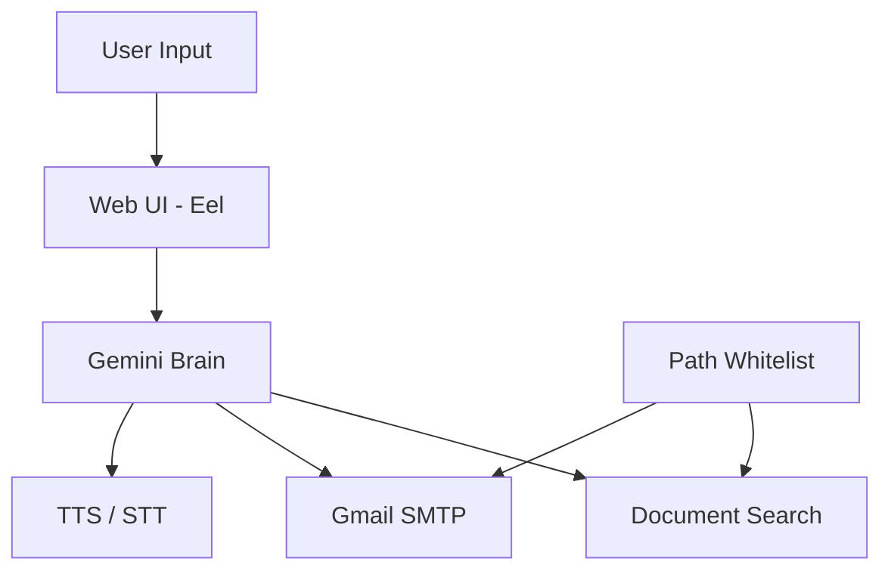

# J.A.R.V.I.S — Personal AI Assistant


> Iron Man-inspired voice & chat assistant with animated UI, powered by Google Gemini.

A local desktop AI assistant with a cinematic interface — 3D particle sphere, Siri-style wave animations, voice commands, secure document search, and Gmail integration.

**Repository:** [github.com/Danyal-0276/Jarvis](https://github.com/Danyal-0276/Jarvis)
https://github.com/Danyal-0276/Jarvis.git
---

## Features

- **Animated UI** — 3D rotating particle sphere, morphing Jarvis hood blobs, SiriWave visualizer
- **AI Chat** — Powered by Google Gemini with J.A.R.V.I.S personality
- **Voice Commands** — Speech-to-text and text-to-speech (mic button)
- **Document Search** — Securely search and read PDF, DOCX, TXT, MD, CSV in allowed folders
- **Email Sending** — Send Gmail with confirmation step before delivery
- **Local & Secure** — Runs on `localhost`, secrets in `.env`, path whitelist for files

---

## Tech Stack

| Layer | Technology |
|-------|------------|
| Backend | Python 3.10+, Eel |
| AI | Google Gemini (`gemini-2.5-flash`) |
| Frontend | HTML, CSS, JavaScript, Bootstrap 5 |
| Animations | Canvas particles, SiriWave, Textillate |
| Voice | SpeechRecognition, pyttsx3 |
| Documents | pypdf, python-docx |
| Email | Gmail SMTP |

---

## Prerequisites

- **Python 3.10+** (use `py` launcher on Windows)
- **Microsoft Edge** (launched in app mode)
- **Google Gemini API key** — [Google AI Studio](https://aistudio.google.com/apikey) (free tier)
- **Gmail App Password** — for email feature ([create here](https://myaccount.google.com/apppasswords))
- **Microphone** — for voice commands (optional)

---

## Quick Start

```bash
# 1. Clone the repository
git clone https://github.com/Danyal-0276/Jarvis.git
cd Jarvis

# 2. Create virtual environment (recommended)
py -m venv venv
venv\Scripts\activate        # Windows

# 3. Install dependencies
py -m pip install --upgrade pip
py -m pip install gevent --only-binary=:all:
py -m pip install -r requirements.txt

# 4. Configure environment
copy .env.example .env
# Edit .env with your API keys

# 5. Run Jarvis
py main.py
```

Jarvis opens automatically in Microsoft Edge app mode at `http://localhost:8000`.

---

## Configuration (`.env`)

| Variable | Description | Example |
|----------|-------------|---------|
| `GEMINI_API_KEY` | Google Gemini API key | `AIza...` |
| `GEMINI_MODEL` | Gemini model name | `gemini-2.5-flash` |
| `ALLOWED_PATHS` | Comma-separated folders Jarvis can read | `C:\Users\You\Documents` |
| `GMAIL_ADDRESS` | Your Gmail address | `you@gmail.com` |
| `GMAIL_APP_PASSWORD` | Gmail App Password (16 chars) | `xxxx xxxx xxxx xxxx` |
| `VOICE_ENABLED` | Enable TTS/STT | `true` |
| `EMAIL_CONFIRMATION` | Require confirmation before sending | `true` |
| `STARTUP_PIN` | Optional PIN to unlock (leave empty to disable) | `1234` |

> **Never commit `.env` to Git.** Use `.env.example` as a template only.

---

## Usage

| Action | How |
|--------|-----|
| **Text chat** | Type in the input box, press Enter or click Send |
| **Voice** | Click the mic icon → speak → Jarvis listens, thinks, and responds |
| **Search documents** | Ask: *"Find my resume"* or *"Summarize the report in my Documents"* |
| **Send email** | Ask: *"Send an email to john@example.com about the meeting"* — confirm when prompted |
| **Settings** | Click the gear icon to view status, re-index documents, clear chat |
| **Confirm email** | Reply *"yes"* or *"confirm"* when Jarvis shows an email preview |

---

## Project Structure

```
Jarvis/
├── main.py                 # App entry point
├── requirements.txt
├── .env.example
├── engine/
│   ├── brain.py            # Gemini chat + tool orchestration
│   ├── tools.py            # Function-calling tool definitions
│   ├── documents.py        # Document indexing & search
│   ├── email_service.py    # Gmail SMTP
│   ├── voice.py            # Speech-to-text & text-to-speech
│   ├── security.py         # Path whitelist validation
│   ├── config.py           # Environment configuration
│   └── features.py         # Eel-exposed API
└── www/
    ├── index.html          # UI layout
    ├── main.js             # Chat, voice, settings logic
    ├── script.js           # Particle sphere animation
    └── style.css           # Dark theme + glow effects
```

---

## Architecture



---

## Security

- All API keys and passwords stored in `.env` (gitignored)
- Document access restricted to `ALLOWED_PATHS` whitelist
- Path traversal attacks blocked via `pathlib.resolve()`
- Only text snippets sent to Gemini — files never uploaded
- Email requires explicit user confirmation before sending
- Server binds to `localhost` only

---

## Windows Notes

**PyAudio** (microphone support):
```bash
py -m pip install pyaudio
```

**Gevent** (Eel dependency) — use prebuilt wheel:
```bash
py -m pip install gevent --only-binary=:all:
```

**Run with `py` not `python`** if Python is not on PATH.

---

## Roadmap

- [x] Animated UI shell
- [x] Gemini AI brain
- [x] Document search & read
- [x] Gmail integration
- [x] Voice commands
- [x] Settings panel
- [ ] WhatsApp messaging
- [ ] Migrate to `google.genai` SDK

---

## Troubleshooting

| Issue | Fix |
|-------|-----|
| `429 Quota exceeded` | Change `GEMINI_MODEL` in `.env` to `gemini-2.5-flash` |
| Gmail auth failed | Use an App Password, not your regular Gmail password |
| Mic not working | Install `pyaudio`, check Windows microphone permissions |
| No documents found | Click Settings → Re-index, verify `ALLOWED_PATHS` in `.env` |
| `python` not found | Use `py main.py` instead |

---

## License

MIT License — feel free to use and modify.

---

## Author

Built by **Danyal** — inspired by J.A.R.V.I.S from Iron Man.
